

# SpeakEasy

Do you want to practice a language? Interact with people from all over the world and learn about their culture?
SpeakEasy is a mobile app where users can connect with native speakers from other countries for the purpose of learning and practicing a new language.

## Views

### Intro 

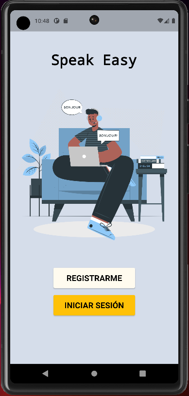

### Connect 

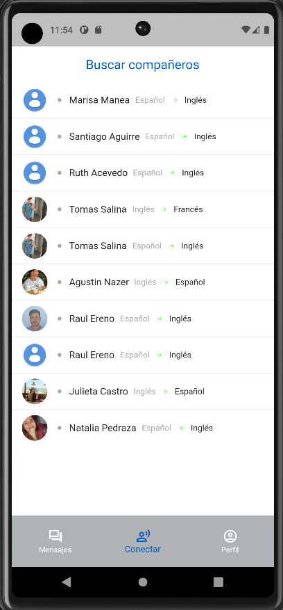

## Profile

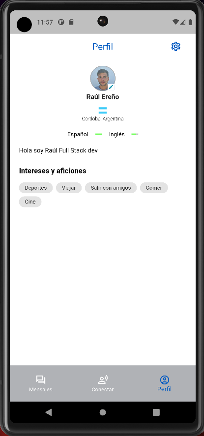

## Chat

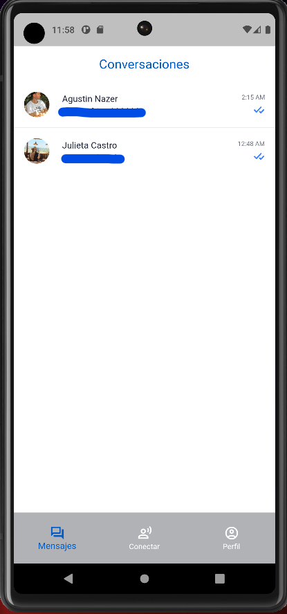

## Chating

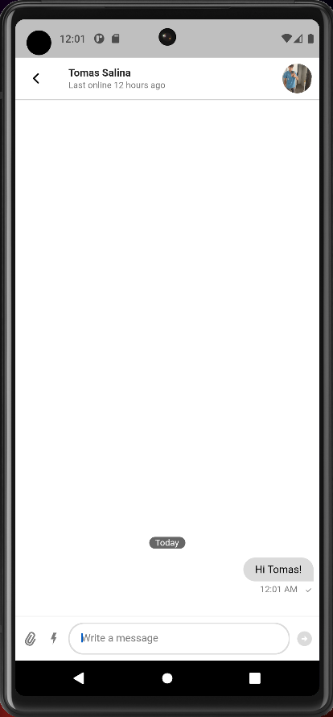

## OnBoarding

| 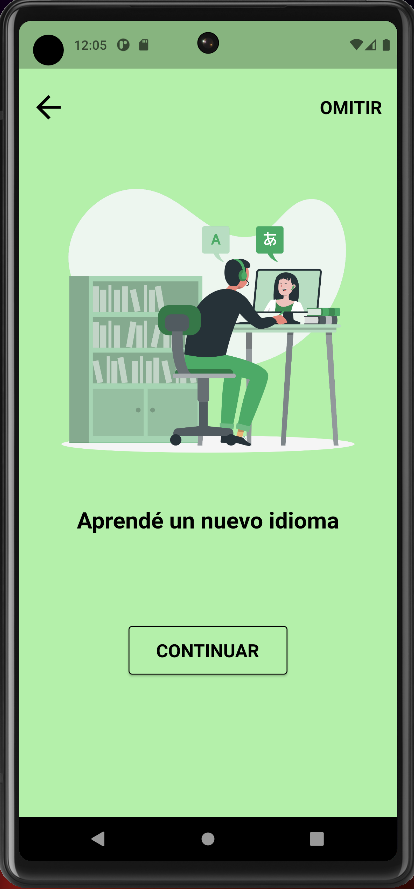 |  | 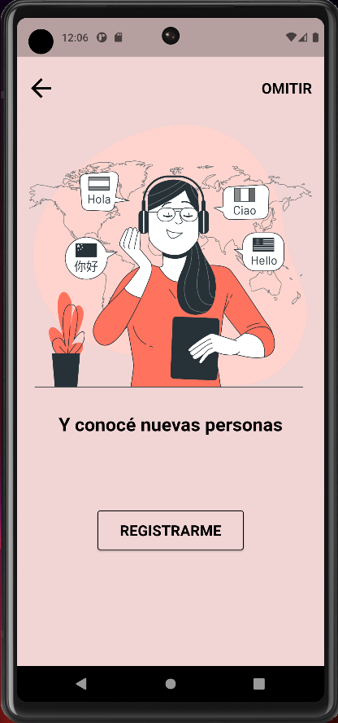 |

## Register 

| 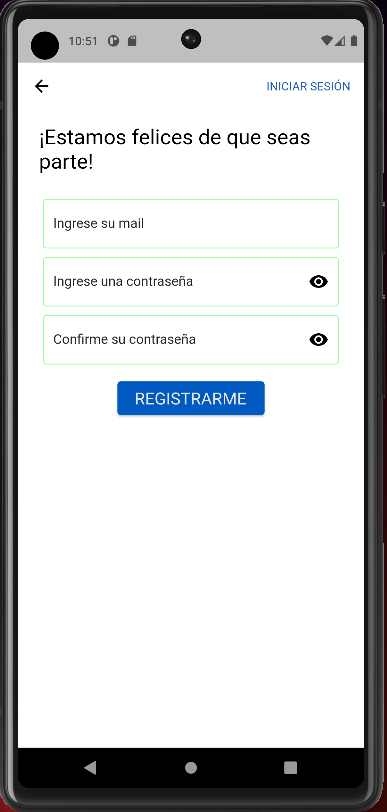 | 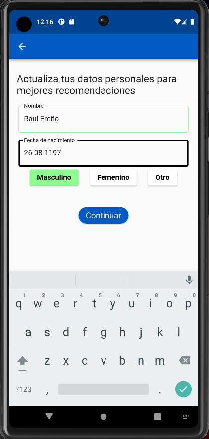 | 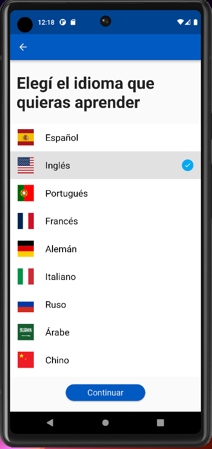 | 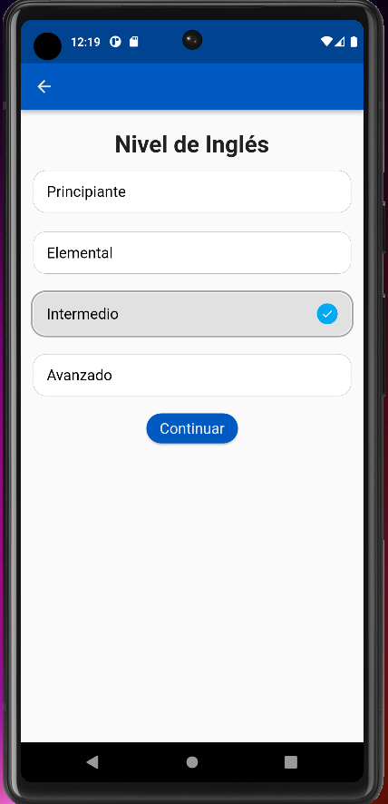 | 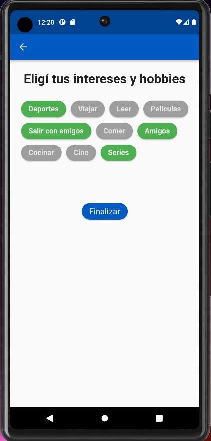 |
## Get Started 🚀

- Clone project
- Configure Firebase stuff (google-services.json and Google-Service.info.plist files)
- Configure your [StreamChat](https://getstream.io/chat/) project

## Features 

- Login and password recovery using Firebase Auth
- Upload pictures using Firebase Storage
- Realtime chat using StreamChat package

### Design

- [Link to Figma](https://www.figma.com/file/hKVw37DvsOzj0qgF8uplYK/APP-NO-COUNTRY?node-id=0%3A1)

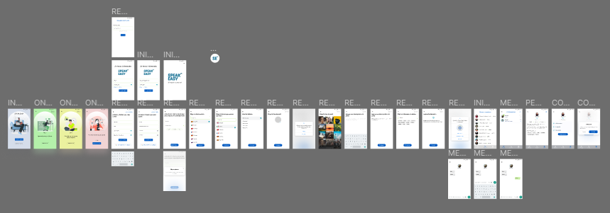 

## Deploy 📦

- [Android Apk Link](https://drive.google.com/file/d/15Ylc4zan_U9Eowa9kYtmCyU-WMm9tGbF/view?usp=share_link)

## Demo 📽️

- [Video](https://drive.google.com/file/d/12XBoAYoOBob9NPuHViQUbrVK7niX9a9o/view?usp=share_link)
## Builded with 🛠️

* [Flutter](https://flutter.dev/) - Framework
* [Dart](https://dart.dev/) - Programming Language
* [Firebase](https://firebase.google.com/?hl=es) - Database & Authentication

## Versioning 📌

- [GitHub](https://github.com/)
## Creators ✒️
#### Group: c9-49-m-flutter

* **Julieta Castro** - *UX/UI Designer* - 

* **Natalia Pedraza** - *QA Tester* - 

* **Tomas Salina** - *Full Stack Developer* - 

* **Agustin Nazer** - *Full Stack Developer* - 

* **Raúl Ereño** - *Full Stack Developer* - 
